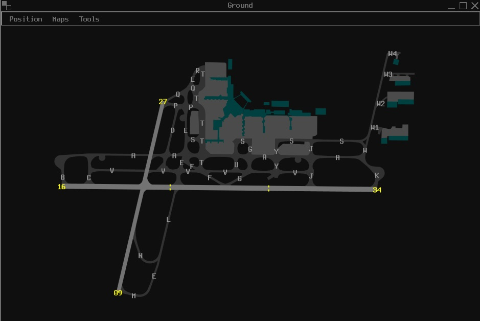

# vatSys Australia Dataset — Dark Theme

This repository contains an **automatically generated dark theme variant**
of the official **vatSys Australia dataset**.

> ⚠️ This is **not** the upstream repository.  
> It exists solely to provide a themed derivative with automated releases.

---

## 🎨 Theme Overview

- **Theme:** Dark
- **Generated:** 2025-12-26
- **Upstream Release:** 2513a
- **Dark Version Format:** `YYMMx-dark` (e.g. `2513a-dark`)

---

## 📥 Installation

1. Download the latest **Dark Theme** ZIP from the **Releases** page.
2. Extract the archive.
3. Copy the extracted profile contents into: Documents\ vatSys Files\ Profiles\ Australia - Dark
4. Launch **vatSys**
5. Select **Australia – Dark** from the profile list

> ℹ️ Restart vatSys if it was running during installation.

---

## 🔄 How This Repository Works

This repository is **fully automated** and follows a strict separation of concerns:

### ✔ Upstream Data
- Sourced directly from **vatSys/australia-dataset**
- No manual edits are made to upstream data
- New upstream tags are detected automatically

### ✔ Automation & Tooling
- All automation lives in the `.github/` directory
- Patch scripts are **authoritative** and preserved across syncs
- Workflow files are **never modified by automation**

### ✔ Generated Output
- A working tree is created from the upstream release
- Patch scripts are applied deterministically
- A tagged dark-themed release is produced
- A ZIP is generated and uploaded

If a themed release already exists for a given upstream tag, the workflow exits safely.

---

## 🛠 Patch Scripts

Patch scripts are written in Python and operate directly on XML map files.

### Included Scripts

1. **`patch_readme.py`**  
Regenerates this README dynamically based on the upstream release.

2. **`patch_colours.py`**  
Applies dark-theme colour definitions consistently.

3. **`patch_profile.py`**  
Updates profile metadata for dark-theme identification.

4. **`patch_coast.py`**  
Adds `CustomColourName="Coast"` to applicable map files.

5. **`patch_ASMGCS.py`**  
Normalises ASMGCS map colour usage.

6. **`patch_ALL_CTA.py`**  
Applies CTA colouring and line-style corrections.

7. **`patch_TMA_LL.py`, `patch_ALL_RTES_PTS.py`, `patch_RWY_files.py`**  
Apply targeted fixes to airspace, routes, and runway map data.

> ⚠️ All scripts overwrite files in-place and are intended for automated use.

---

## 🚀 Release Process (Automation)

Each release follows this process:

1. Detect latest upstream tag
2. Check if `2513a-dark` already exists
3. Rebase working tree onto upstream data
4. Restore `.github/` tooling
5. Apply all patch scripts
6. Commit **data-only changes**
7. Create a dark-theme tag
8. Build and upload ZIP asset
9. Publish GitHub Release
10. Upload payload to public hosting (FTP)

This ensures:
- Reproducible output
- No workflow self-modification
- No accidental upstream drift

---

## ⬇️ Downloads

### GitHub Releases (Recommended)

Each release includes:
- A pre-packaged ZIP
- One-to-one mapping with upstream versions
- Ready-to-install vatSys profile

Once installed, the profile can update automatically via public hosting.

---

## 📦 Repository Contents

- Dark-themed dataset files
- Profile configuration
- Automation tooling and patch scripts
- Release packaging logic

---

## ⚖️ Attribution

- Original dataset © vatSys Australia contributors
- Theme modifications and automation maintained independently
- This project is **not affiliated with or endorsed by vatSys, VATSIM, or VATPAC**

---

## ⚠️ Disclaimer & Limitation of Liability

This project is provided **as-is**, without warranty of any kind.

By using this dataset, you acknowledge that:

- Use is entirely **at your own risk**
- No liability is accepted for errors or omissions
- No guarantee of fitness for any purpose is provided
- Automated updates may change files without notice

This applies to the dataset, scripts, automation, and generated releases.

---

## 🧩 Issues & Support

For issues related to:
- Dark theme appearance
- Automation behaviour
- Patch scripts

Please open an issue **in this repository**, not upstream.
